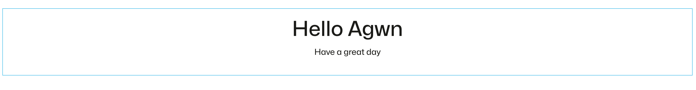
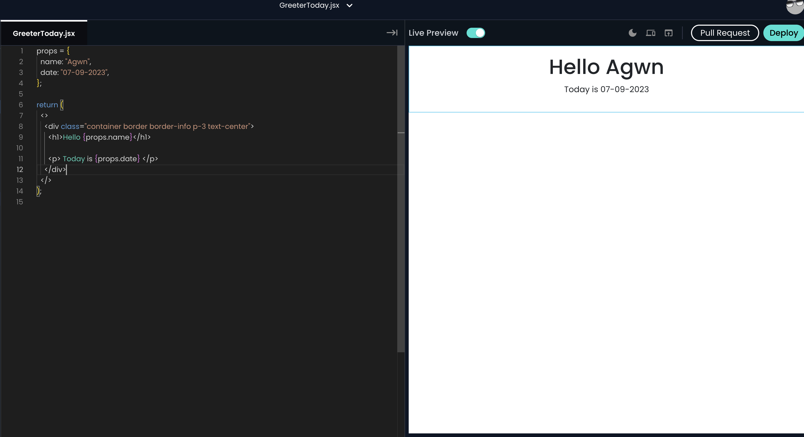
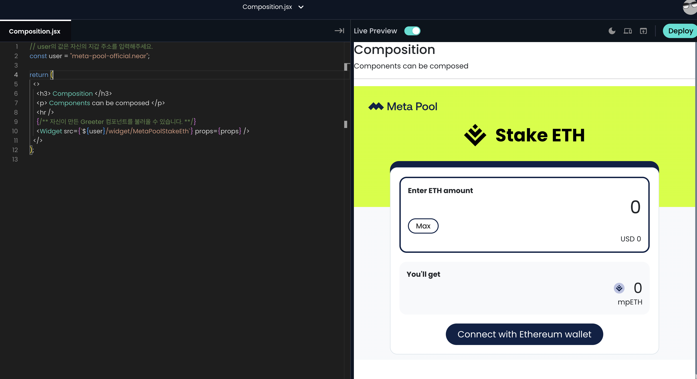

- [X] Greeter 위젯의 이름을 GreeterYourName으로 바꿔보세요.
  - https://near.org/near/widget/ComponentDetailsPage?src=022af1caad690511f2164a3356c44d35fdf61db7d3de2c719ad7071915e6fad0/widget/GreeterYourName
  
- [X] idknwhoru.near/widget/GreeterToday을 fork 하고 실행 화면을 Hello Agwn! Today is 07-09-2023 바꿔보세요.
  - https://near.org/near/widget/ComponentDetailsPage?src=022af1caad690511f2164a3356c44d35fdf61db7d3de2c719ad7071915e6fad0/widget/GreeterToday
  - 
- [X] Composition에 포함된 위젯을 idknwhoru.naer/widget/Greeter에서 다른 위젯으로 바꿔보세요.(위젯을 검색하는 방법은 4. Greeter 위젯 불러오기와 6. Composition 만들기를 참고)
  - https://near.org/near/widget/ComponentDetailsPage?src=022af1caad690511f2164a3356c44d35fdf61db7d3de2c719ad7071915e6fad0/widget/Composition
  
  
