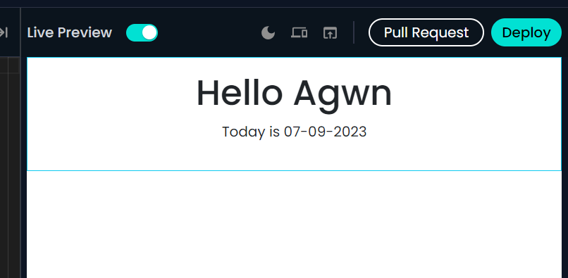

# Mission

- [ ] Greeter 위젯의 이름을 `GreeterYourName`으로 바꿔보세요.

https://near.social/sunny0827.near/widget/GreeterSunny?name=Sunny

- [ ] `idknwhoru.near/widget/GreeterToday`을 fork 하고 실행 화면을 `Hello Agwn! Today is 07-09-2023` 바꿔보세요.
  > 위젯의 소스 코드를 실행하지 않고, `jutsu.ai`의 Props를 이용해보세요!
  > 2번 과제의 결과물은 위젯 주소와 `jutsu.ai`에서 과제를 실습한 화면을 캡쳐한 이미지를 첨부 해주세요.

https://near.social/sunny0827.near/widget/GreeterToday?peername=Agwn&date=07-09-2023

- [ ] Composition에 포함된 위젯을 `idknwhoru.naer/widget/Greeter`에서 다른 위젯으로 바꿔보세요.(위젯을 검색하는 방법은 4. Greeter 위젯 불러오기와 6. Composition 만들기를 참고)

greeter 예시모양 없어서 비슷하게 하나 만들었습니다. https://near.social/sunny0827.near/widget/Greeter?program=Harmonic%20Guild&greeting=Check%20our%20latest%20fully%20onchain%20Apps%20below.
새로 만든 greeter 넣었습니다. https://near.social/sunny0827.near/widget/Composition?program=Harmonic%20Guild&greeting=Check%20our%20latest%20fully%20onchain%20Apps%20below.
