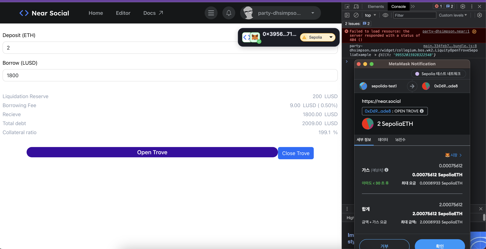

- [x] openTrove가 성공한 지갑은 closeTrove가 실행되기 전까지 이 지갑은 이미 활성화된 트로브가 있습니다. 메세지를 표시해주세요.
    - 
- [x] borrowWrapper 컴포넌트의 스타일을 외부 css파일을 불러와서 적용해보세요.
    - 
- [x] openTrove 기능의 가스 비용을 최적화 하기 위해 NICR이라는 값을 계산해야 합니다. openTrove 함수에 NICR을 계산하는 기능을 추가해주세요.
    - 