# Collegium-BOS-WK2
> ❗ nearpad.dev 사이트가 jutsu.ai로 변경되었습니다. 이미지 참고 자료에 나와있는 nearpad.dev 주소를 신경쓰지 말고 작업해주세요.
## 주제: 위젯을 좀 더 인터렉티브하게 만들기

## 1. 온라인 에디터 환경 접속하기
1. [jutsu 편집기](https://jutsu.ai/editor) 사이트에 접속해주세요.

## 2. State를 이용하여 UI에 변경을 발생시키기
1. `idknwhoru.near/widget/collegium.bos.wk2.StateWidget` 위젯을 fork 해주세요.

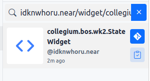

2. switch 버튼을 클릭했을 때 turn off 메시지가 변경되는 것을 확인해주세요.

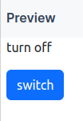

## 3. Web3 지갑 연결하기
1. `idknwhoru.near/widget/collegium.bos.wk2.Web3ConnectWidget` 위젯을 fork 해주세요.

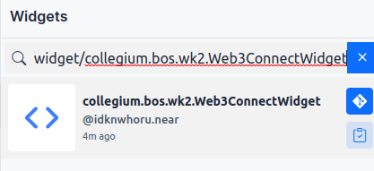

2. `Connect Web3 Wallet` 버튼을 클릭해주세요.

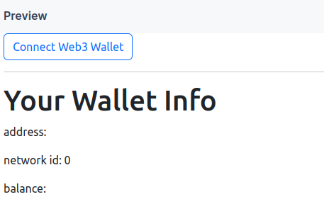

3. MetaMask를 선택해주세요.

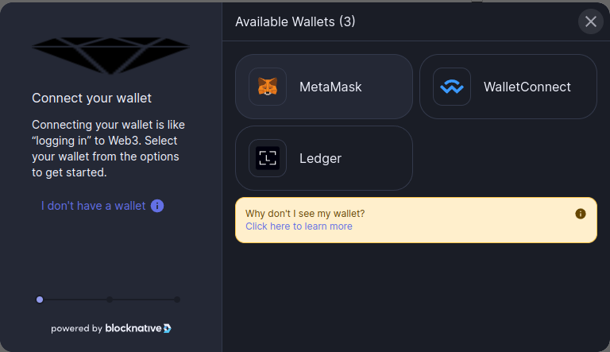

4. MestaMask 비밀번호를 입력하고, `unlock` 버튼을 클릭해주세요.

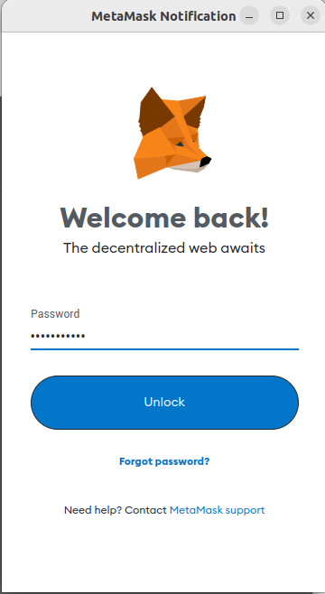

5. 지갑 정보가 변경된 것을 확인해주세요.

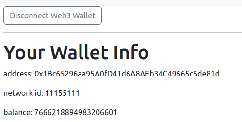

## 4. Ethereum 컨트랙트 사용하기

1. `idknwhoru.near/widget/collegium.bos.wk2.EthereumContractWidget` 위젯을 fork 해주세요.

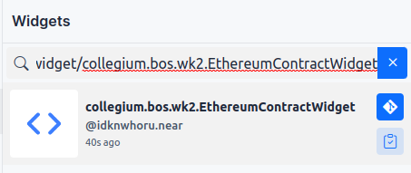

2. 화면에 아래와 같은 메시지가 표시될 경우 `Sepolia`로 네트워크를 변경해주세요.

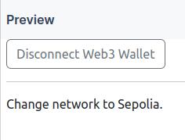

3. metamask extension에서 변경할 수 있습니다.

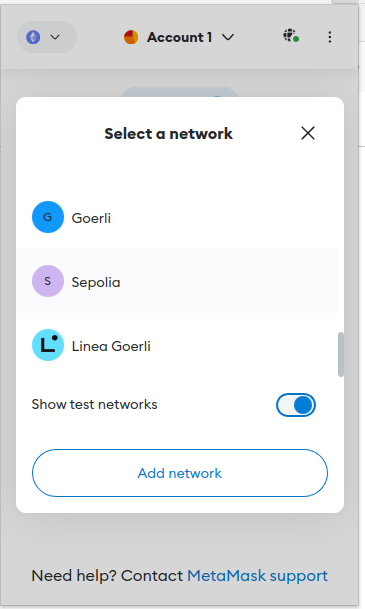

4. 변경된 화면을 확인해주세요.

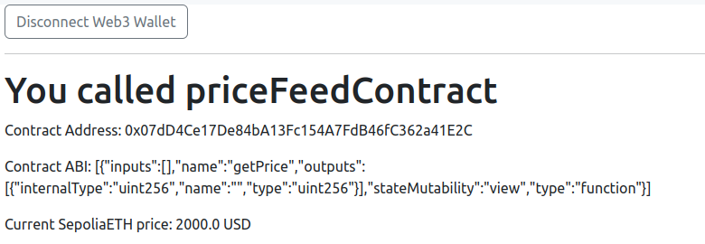

## Mission
아래 DeFi 애플리케이션을 구현해주세요.
- 위젯: `idknwhoru.near/widget/collegium.bos.wk2.LiquityOpenTroveSepoliaExample`
- 추가 요청 사항은 다음과 같습니다. 
    - [ ] `openTrove`가 성공한 지갑은 `closeTrove`가 실행되기 전까지 `이 지갑은 이미 활성화된 트로브가 있습니다.` 메세지를 표시해주세요.
        - hint 1: 이미 활성화된 트로브를 알아 낼 수 있는 방법은 `state.isOpenTrove === true` 입니다.
    - [ ] `borrowWrapper` 컴포넌트의 스타일을 외부 css파일을 불러와서 적용해보세요.
        - hint 1: [fetch API](https://docs.near.org/bos/api/fetch)를 사용하세요.
        - hint 2: `https://raw.githubusercontent.com/LudiumAgwn/collegium-bos-wk2/main/assets/code/liquity-widget.css`를 불러와주세요.
    - [ ] `openTrove` 기능의 가스 비용을 최적화 하기 위해 NICR이라는 값을 계산해야 합니다. openTrove 함수에 NICR을 계산하는 기능을 추가해주세요.
        - NICR = Ether / LUSD * 100
        - hint 1: [ethers.js](https://docs.near.org/bos/tutorial/ethers-js) api 기능을 사용해서 계산해주세요
        - hint 2: hint 1의 자료가 부족할 경우 [이 문서](https://docs.ethers.org/v5/)를 참고해주세요.

- [결과물 확인 안내](https://github.com/LudiumAgwn/collegium-bos-wk2/tree/mission_result)
