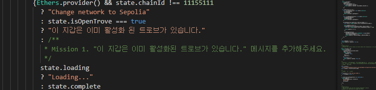

아래 DeFi 애플리케이션을 구현해주세요.

위젯: idknwhoru.near/widget/collegium.bos.wk2.LiquityOpenTroveSepoliaExample

추가 요청 사항은 다음과 같습니다.

- [x] openTrove가 성공한 지갑은 closeTrove가 실행되기 전까지 이 지갑은 이미 활성화된 트로브가 있습니다. 메세지를 표시해주세요.
hint 1: 이미 활성화된 트로브를 알아 낼 수 있는 방법은 state.isOpenTrove === true 입니다.

- [x] borrowWrapper 컴포넌트의 스타일을 외부 css파일을 불러와서 적용해보세요.
hint 1: fetch API를 사용하세요.
hint 2: https://raw.githubusercontent.com/LudiumAgwn/collegium-bos-wk2/main/assets/code/liquity-widget.css를 불러와주세요.

- [x] openTrove 기능의 가스 비용을 최적화 하기 위해 NICR이라는 값을 계산해야 합니다. openTrove 함수에 NICR을 계산하는 기능을 추가해주세요.
NICR = Ether / LUSD * 100
hint 1: ethers.js api 기능을 사용해서 계산해주세요
hint 2: hint 1의 자료가 부족할 경우 이 문서를 참고해주세요.

