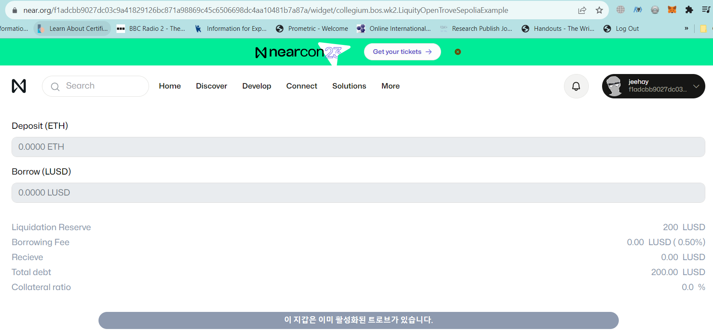
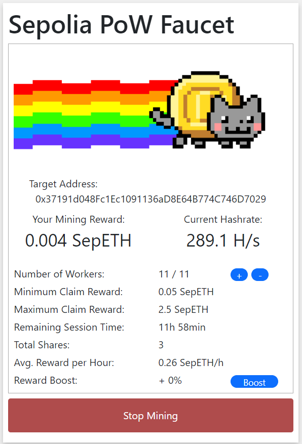

## ✏️ mission-wk2-jeehay

#### &#9745; DeFi 애플리케이션을 구현

🔗
https://near.org/f1adcbb9027dc03c9a41829126bc871a98869c45c6506698dc4aa10481b7a87a/widget/collegium.bos.wk2.LiquityOpenTroveSepoliaExample

#### &#9745; openTrove가 성공한 지갑은 closeTrove가 실행되기 전까지 "이 지갑은 이미 활성화된 트로브가 있습니다." 메세지를 표시해주세요.



```
 <div className="confirm-wrapper">
      {state.address ? (
        <button
          className={`confirm ${state.isBlocked ? "not-ok" : "ok"}`}
          disabled={state.isBlocked}
          onClick={openTrove}
        >
          {Ethers.provider() && state.chainId !== 11155111
            ? "Change network to Sepolia"
            : /**
             * Mission 1. "이 지갑은 이미 활성화된 트로브가 있습니다." 메시지를 추가해주세요.
             */
            state.isOpenTrove === true
            ? "이 지갑은 이미 활성화된 트로브가 있습니다."
            : state.loading
            ? "Loading..."
            : state.complete
            ? "Done ✅"
            : state.coll === 0 || state.borrow === 0
            ? "Enter input value"
            : state.isBlocked
            ? "Check stats"
            : "Open Trove"}
        </button>
      ) : (
        <Web3Connect className="connect-wallet" />
      )}
    </div>

```

#### &#9745; borrowWrapper 컴포넌트의 스타일을 외부 css파일을 불러와서 적용해보세요.

```
/**
 * Mission 2. `borrowWrapper` 컴포넌트의 스타일을 외부 css파일을 불러와서 적용해보세요.
 * 외부 css 파일 링크: "https://raw.githubusercontent.com/LudiumAgwn/collegium-bos-wk2/main/assets/code/liquity-widget.css"
 * 여기를 고쳐주세요.
 */
const cssLink =
  "https://raw.githubusercontent.com/LudiumAgwn/collegium-bos-wk2/main/assets/code/liquity-widget.css";
const cssData = fetch(cssLink).body;
```

#### &#9745; openTrove 기능의 가스 비용을 최적화 하기 위해 NICR이라는 값을 계산해야 합니다. openTrove 함수에 NICR을 계산하는 기능을 추가해주세요.

```
const _1e20 = ethers.BigNumber.from(ethers.utils.parseEther("100"));

  const ETHColl = ethers.BigNumber.from(
    ethers.utils.parseEther(state.coll.toString())
  );

  /** Mission 3. NICR의 값을 구해주세요
   * 계산 식: NICR = ETHColl * 1e20 / expectedDebt
   * 아래의 계산 방법을 이용하되 ethersjs의 BigNumber API를 이용하세요
   * 참고 문서: https://docs.ethers.org/v5/api/utils/bignumber/#BigNumber--BigNumber--methods--math-operations
   * 입력창에 2ETH, 1800LUSD를 입력했을 때 NICR.toString()의 결과 값: "99552015928322548"
   */
  // const NICR = (ETHColl * _1e20) / expectedDebt;
  const NICR = ETHColl.mul(_1e20).div(expectedDebt)
  console.log({ NICR: NICR.toString() });

```

#### &#9745; Mining @Sepolia PoW Faucet
🔗
https://sepolia-faucet.pk910.de/
