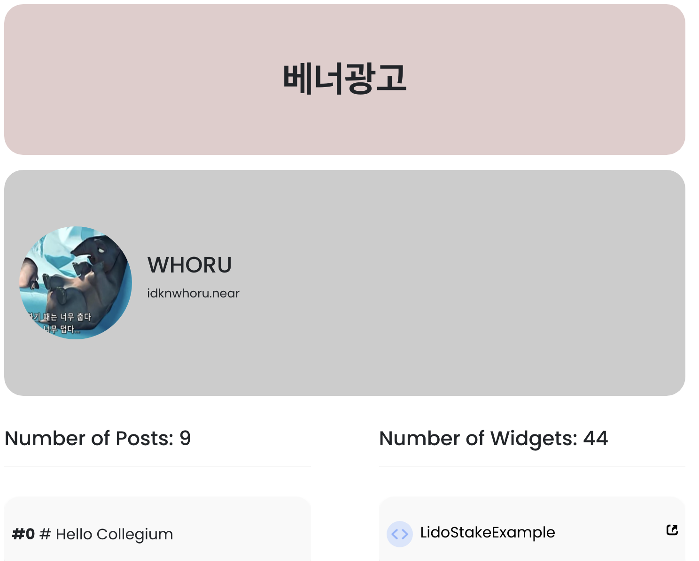

## Mission
### 내 정보를 표시하는 페이지를 만들어주세요.
#### 아래 컴포넌트로 화면을 구성해주세요.
##### Profile
- [x] 아바타 이미지
- [x] Name
- [x] 지갑 계정
##### Post
- [x] 포스팅 글 수
- [x] 포스팅 글
##### Widget
- [x] 위젯 수
- [x] 위젯 이름
- [x] 위젯 이름을 클릭하면 새 탭에서 위젯을 실행할 수 있습니다.

## 결과물
 - https://near.social/party-dhsimpson.near/widget/donnie.bos.my-social
 - 

   - c.f. 내 계정의 경우엔 profile 데이터가 null 이 호출 돼서 결과물 이미지는 whoru 꺼 account_id 하드코딩으로 넣은 다음에 한 거야!
