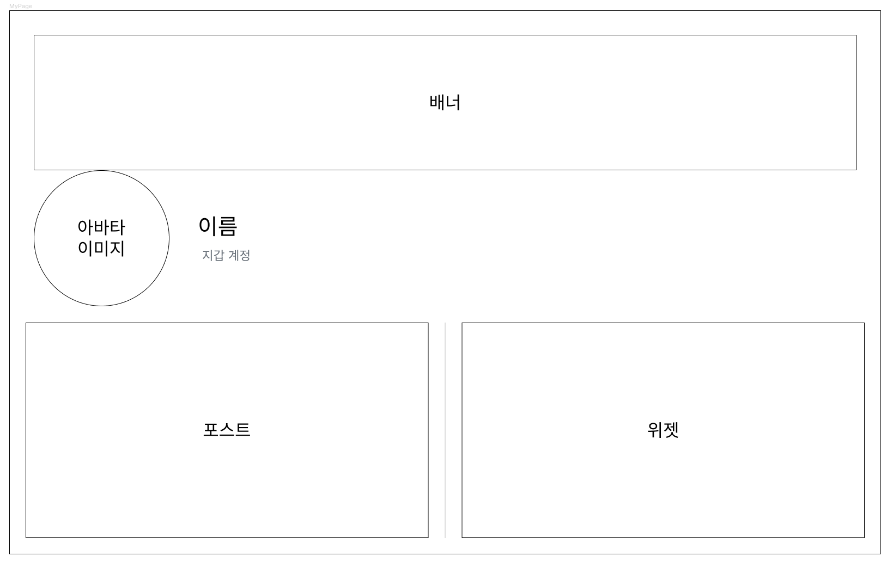

## Mission
### 내 정보를 표시하는 페이지를 만들어주세요.
#### 아래 컴포넌트로 화면을 구성해주세요.
##### Profile
- [ ] 아바타 이미지
- [ ] Name
- [ ] 지갑 계정
##### Post
- [ ] 포스팅 글 수
- [ ] 포스팅 글
##### Widget
- [ ] 위젯 수
- [ ] 위젯 이름
- [ ] 위젯 이름을 클릭하면 새 탭에서 위젯을 실행할 수 있습니다.

#### 와이어 프레임

#### [결과물 확인](https://near.org/c842b1a648114a20cfca00f01718ee4c6f46d772951d9f8f31dffc189da63b80/widget/collegium.bos.wk3.Mission)

#### [결과물 소스 코드 확인](https://near.org/near/widget/ComponentDetailsPage?src=c842b1a648114a20cfca00f01718ee4c6f46d772951d9f8f31dffc189da63b80/widget/collegium.bos.wk3.Mission&tab=source)

