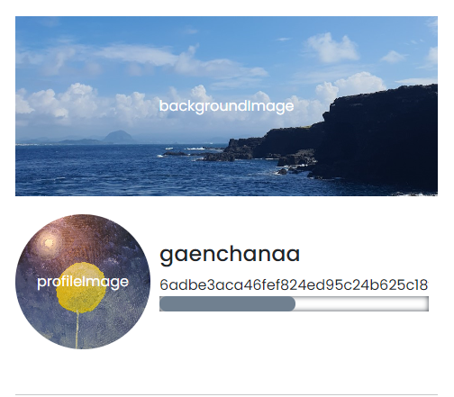
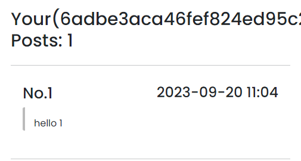
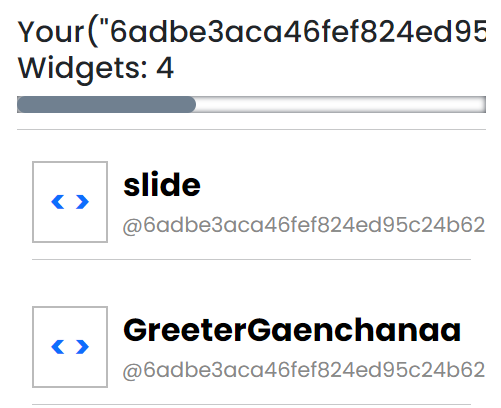

## Mission
### 내 정보를 표시하는 페이지를 만들어주세요.
#### 아래 컴포넌트로 화면을 구성해주세요.

##### Profile
- [x] 아바타 이미지
- [x] Name
- [x] 지갑 계정

  

##### Post
- [x] 포스팅 글 수
- [x] 포스팅 글

  

##### Widget
- [x] 위젯 수
- [x] 위젯 이름
- [x] 위젯 이름을 클릭하면 새 탭에서 위젯을 실행할 수 있습니다.

  

배포한 위젯 링크: https://near.org/near/widget/ComponentDetailsPage?src=6adbe3aca46fef824ed95c24b625c18fd7c6d978ff713ea11a22cd5b028940f2/widget/collegium.bos.wk3.SocialWidget

#### 와이어 프레임

#### [결과물 확인](https://near.org/idknwhoru.near/widget/collegium.bos.wk3.MyProfilePage)

#### [결과물 소스 코드 확인](https://near.org/near/widget/ComponentDetailsPage?src=idknwhoru.near/widget/collegium.bos.wk3.MyProfilePage)
