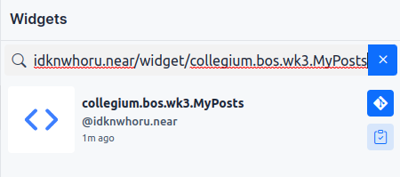
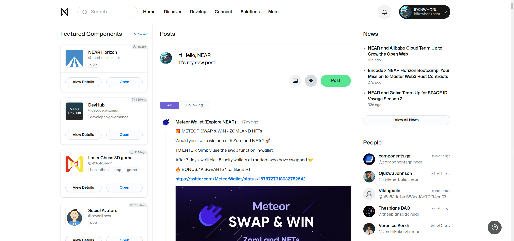
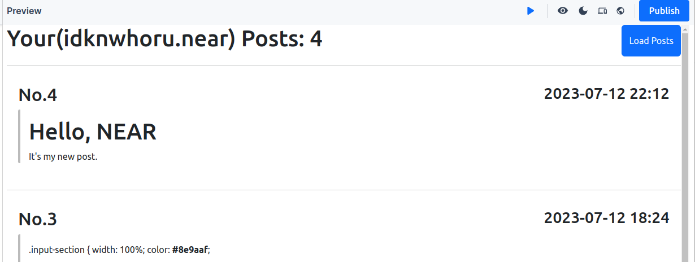
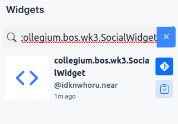
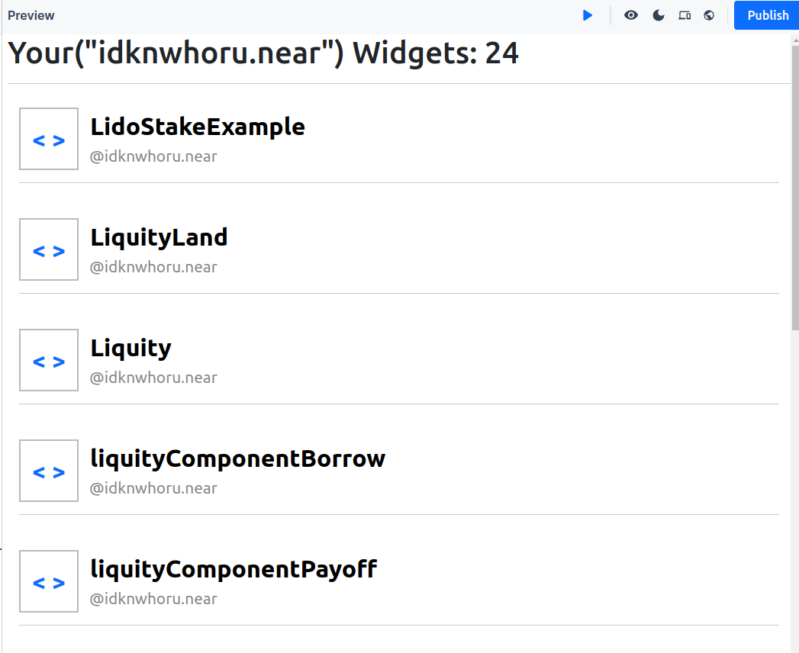

# Collegium-BOS-WK3
> ❗ nearpad.dev 사이트가 jutsu.ai로 변경되었습니다. 이미지 참고 자료에 나와있는 nearpad.dev 주소를 신경쓰지 말고 작업해주세요.
## 주제: 소셜 DB 컨트랙트에서 데이터를 가져오기

## 1. 온라인 에디터 환경 접속하기
1. [jutsu 편집기](https://jutsu.ai/editor) 사이트에 접속해주세요.

## 2. indexer를 이용하여 내 게시글 불러오기
1. `idknwhoru.near/widget/collegium.bos.wk3.MyPosts` 위젯을 fork 해주세요.

2. [near](https://near.org/) 페이지에 접속합니다
3. 새로운 Post를 작성합니다.

4. `Load Posts` 버튼을 클릭한 뒤, 새로운 포스트를 확인합니다.

## 3. Social DB를 이용하여 데이터 가져오기
1. `idknwhoru.near/widget/collegium.bos.wk3.SocialWidget` 위젯을 fork 해주세요.

2. 내가 만든 위젯 목록을 확인해주세요.
3. 아이콘, 위젯 제목, 작성자를 클릭해보세요.

## Mission
### 내 정보를 표시하는 페이지를 만들어주세요.
#### 아래 컴포넌트로 화면을 구성해주세요.
##### Profile
- [ ] 아바타 이미지
- [ ] Name
- [ ] 지갑 계정
##### Post
- [ ] 포스팅 글 수
- [ ] 포스팅 글
##### Widget
- [ ] 위젯 수
- [ ] 위젯 이름
- [ ] 위젯 이름을 클릭하면 새 탭에서 위젯을 실행할 수 있습니다.

#### 와이어 프레임

#### [결과물 확인](https://near.org/idknwhoru.near/widget/collegium.bos.wk3.MyProfilePage)

#### [결과물 소스 코드 확인](https://near.org/near/widget/ComponentDetailsPage?src=idknwhoru.near/widget/collegium.bos.wk3.MyProfilePage)
