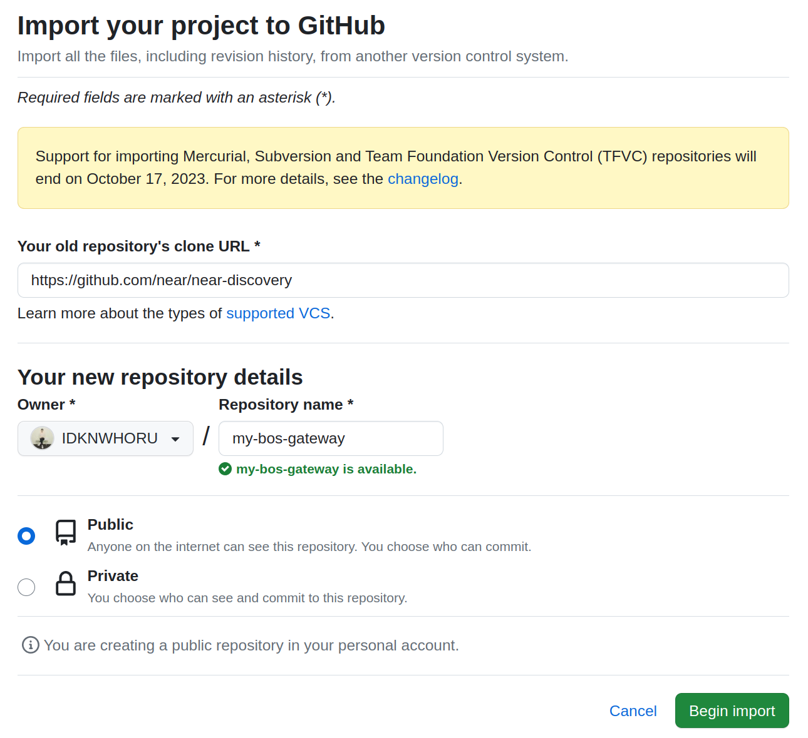
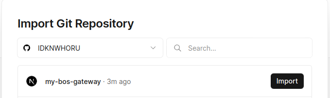
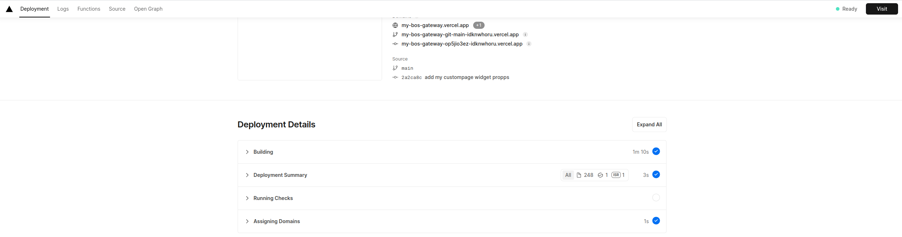
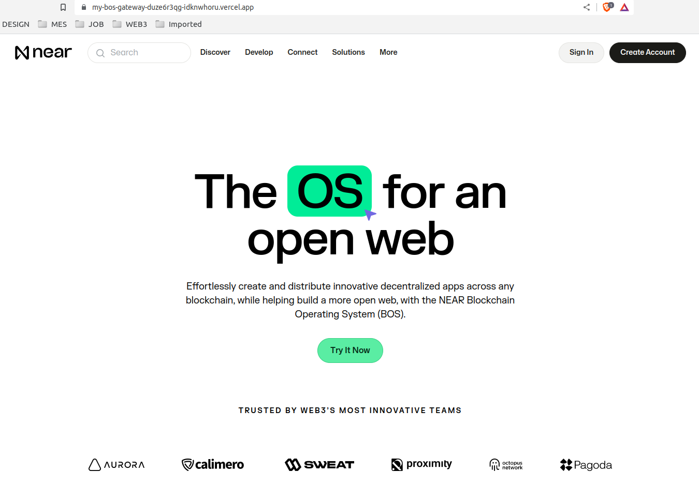

# Collegium-BOS-WK4

## 주제: 내가 만든 위젯을 호스팅 하기

## 1. Vercel에 BOS Gateway를 빌드하고 배포하기
1. [Github Project Import](https://github.com/new/import) 페이지로 이동해주세요.
2. 아래와 같이 정보를 입력해주세요.
    - Your old repository's clone URL: `https://github.com/near/near-discovery`
    - Repository name: `my-bos-gateway`
3. `Begin import` 버튼을 클릭해주세요.

4. [vercel](https://vercel.com/)에서 회원가입과 로그인을 해주세요.
5. [프로젝트 생성](https://vercel.com/new) 페이지로 이동해주세요.
6. `my-bos-gateway` 옆에 `import` 버튼을 클릭해주세요.

7. `Deploy` 버튼을 클릭해주세요.

8. 빌드와 배포가 성공하면 `Visit` 버튼을 클릭해주세요.

9. Near 웹 사이트가 나오는 것을 확인해주세요.

## Mission
### Collegium-BOS-WK3 Mission에서 만든 위젯을 BOS Gateway를 이용하여 배포해주세요.
#### 요구사항
- [ ] `my-bos-gateway` Github 저장소에서 작업해주세요.
- [ ] `.env` 파일을 만들어서 near 메인넷에서 동작하게 해주세요.
- [ ] 첫 화면에 접속할 때 Near 웹사이트가 아니라 Collegium-BOS-WK3 Mission에서 만든 위젯이 나타나게 해주세요.

#### [결과물 확인](https://my-bos-gateway.vercel.app/)
#### [결과물 프로젝트](https://github.com/IDKNWHORU/my-bos-gateway)
